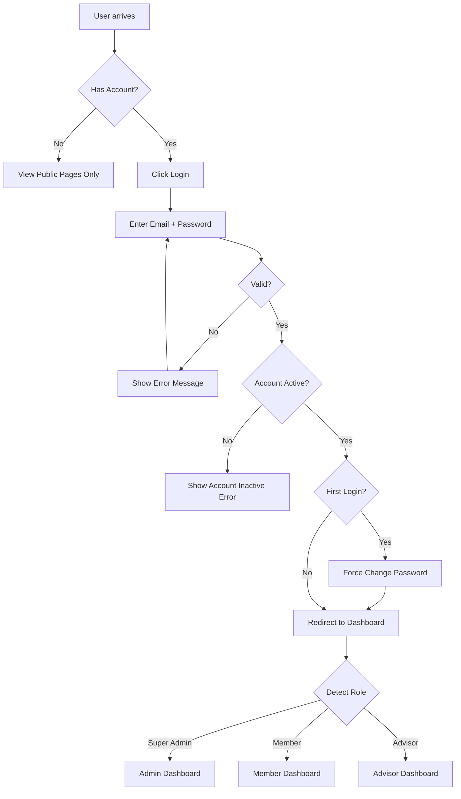

# SPECIFICATION DOCUMENT
## Web Aplikasi Kelompok Tani Thangun Afa

**Version:** 2.0 (Enhanced)  
**Date:** January 2026  
**Status:** Production Ready Specification  
**Project Type:** MVP (Minimum Viable Product)

---

## TABLE OF CONTENTS

1. [Project Overview](#1-project-overview)
2. [Tech Stack](#2-tech-stack)
3. [User Roles & Permissions](#3-user-roles--permissions)
4. [Database Architecture](#4-database-architecture)
5. [Page Structure & Routes](#5-page-structure--routes)
6. [Feature Specifications](#6-feature-specifications)
7. [UI/UX Design System](#7-uiux-design-system)
8. [Mobile-First Strategy](#8-mobile-first-strategy)
9. [Error Handling & Validation](#9-error-handling--validation)
10. [API Integration Patterns](#10-api-integration-patterns)
11. [Development Phases](#11-development-phases)
12. [Testing Strategy](#12-testing-strategy)
13. [Deployment & DevOps](#13-deployment--devops)
14. [Security & Performance](#14-security--performance)
15. [Cost Estimation](#15-cost-estimation)
16. [Documentation Strategy](#16-documentation-strategy)
17. [Future Enhancements](#17-future-enhancements)
18. [Appendices](#18-appendices)

---

## 1. PROJECT OVERVIEW

### 1.1 Executive Summary

Web aplikasi untuk **Kelompok Tani Thangun Afa** yang berfokus pada **hortikultura**. Aplikasi menggabungkan:
- **Public website** untuk informasi kelompok (profil, berita, galeri)
- **Internal system** untuk manajemen keuangan (pencatatan transaksi produksi)
- **Analytics dashboard** untuk monitoring performa kelompok & individu

### 1.2 Situasi & Constraints

| Aspek | Detail |
|-------|--------|
| **Data Migration** | Fresh start (tidak ada data existing) |
| **Volume Transaksi** | 300-500 transaksi/bulan (medium load) |
| **Budget** | Supabase free tier + Vercel free |
| **Developer** | Single developer = Super Admin + Content Creator |
| **User Device** | Mobile-first (smartphone primary) |
| **Training Time** | 1 hari |
| **Dokumentasi** | Bahasa Indonesia |

### 1.3 Business Objectives

| Objective | Key Result | Measurement |
|-----------|------------|-------------|
| **Transparansi Keuangan** | 100% transaksi tercatat digital | Adoption rate >90% dalam 3 bulan |
| **Efisiensi Administrasi** | Reduce laporan manual 80% | Waktu buat laporan: 2 jam → 15 menit |
| **Data-Driven Decisions** | Dashboard aktif digunakan | Min 20 user aktif/bulan view dashboard |
| **Digital Presence** | Visible di online | Website traffic 100+ visit/bulan |

### 1.4 Target Users

| Role | Count | Device Primary | Tech Savviness |
|------|-------|----------------|----------------|
| **Super Admin** | 1 | Smartphone | Medium-High |
| **Anggota** | ~30 | Smartphone | Low-Medium |
| **Penasehat** | 2-3 | Smartphone/Laptop | Medium |
| **Public Visitors** | Unlimited | Mobile/Desktop | Any |

### 1.5 Key Success Metrics

**Adoption Metrics:**
- 90% anggota aktif input transaksi dalam bulan pertama
- Min 2 transaksi per anggota per minggu

**Quality Metrics:**
- Data accuracy: <5% error rate
- User satisfaction: >4/5 rating
- System uptime: >99%

**Performance Metrics:**
- Page load: <3 seconds (mobile 4G)
- Time to Interactive: <5 seconds
- Dashboard load: <2 seconds dengan data

### 1.6 Scope & Constraints

**In Scope (MVP - Must Have Launch Day):**
✅ Login/logout (authentication)  
✅ Dashboard (basic KPI cards)  
✅ Input transaksi (expense + income)  
✅ List transaksi (filter by date & type)  
✅ Export Excel (basic)  
✅ User management (admin)  
✅ Landing page (basic info)  
✅ Mobile responsive  

**Nice to Have (Week 2-4 after launch):**
☐ Advanced charts (donut, bar)  
☐ Export PDF  
☐ Rich text editor untuk berita  
☐ Gallery management  
☐ Category management  
☐ Advanced filters  

**Out of Scope (Post-MVP):**
❌ Mobile native apps (iOS/Android)  
❌ Offline mode  
❌ Push notifications  
❌ AI/ML predictive analytics  
❌ Multi-language support  
❌ Integration dengan bank/accounting software  
❌ Approval workflows  
❌ Real-time chat/collaboration  
❌ PWA install (can wait)  

**Constraints:**
- **Timeline:** Secepatnya
- **Budget:** Limited (menggunakan free/low-cost services)
- **Internet:** Stable connection required (tidak ada offline mode)
- **Data Migration:** Tidak ada data existing yang perlu dimigrasikan
- **Device:** Optimized untuk smartphone (rata-rata user pakai mobile)

---

## 2. TECH STACK

### 2.1 Frontend Stack

| Technology | Version | Purpose | Why Chosen |
|------------|---------|---------|------------|
| **React** | 18+ | UI Framework | Industry standard, large ecosystem |
| **Vite** | 5+ | Build Tool | Fast HMR, modern, smaller bundle |
| **Tailwind CSS** | 3.4+ | Styling | Utility-first, responsive, consistent |
| **shadcn/ui** | Latest | UI Components | Pre-built, accessible, saves ~30% styling time |
| **React Router** | 6+ | Routing | Standard routing solution |
| **React Query** | 5+ | Server State | Caching, optimistic updates, auto-refetch |
| **React Hook Form** | 7+ | Form Management | Performant, less re-renders |
| **Zod** | 3+ | Validation | Type-safe schema validation |
| **Recharts** | 2+ | Charts | Composable, responsive charts |
| **Lucide React** | Latest | Icons | Modern, lightweight icon set |
| **date-fns** | 3+ | Date Utilities | Lightweight date manipulation |
| **XLSX** | Latest | Excel Export | Client-side Excel generation |
| **jsPDF** | Latest | PDF Export | Client-side PDF generation |

**Additional Libraries:**
- **browser-image-compression** - Image optimization before upload
- **react-hot-toast** - Toast notifications
- **clsx** / **tailwind-merge** - Conditional class names

### 2.2 Backend Stack (Supabase)

| Service | Purpose | Tier |
|---------|---------|------|
| **Supabase Auth** | Authentication & user management | Free |
| **PostgreSQL** | Main database | Free (500MB) |
| **Storage** | File uploads (photos) | Free (1GB) |
| **Edge Functions** | Serverless functions (optional) | Free tier |
| **Realtime** | Live updates (optional for v2) | Free tier |

**Supabase Features Used:**
- Row Level Security (RLS)
- Database triggers & functions
- Storage bucket policies
- Automatic backups (paid plan recommended)

### 2.3 State Management Strategy

```
Global State (React Context):
├─ Auth User (session, profile)
├─ Theme (if dark mode added later)

Server State (React Query - Recommended over plain fetch):
├─ Transactions
├─ Users
├─ News articles
├─ Gallery photos
├─ Categories & Commodities

Form State (React Hook Form):
├─ All forms with Zod validation
```

### 2.4 DevOps & Deployment

| Service | Purpose | Tier |
|---------|---------|------|
| **Vercel** | Frontend hosting & CI/CD | Free (Hobby) |
| **GitHub** | Version control & collaboration | Free |
| **Supabase Cloud** | Backend hosting | Free → Pro ($25/mo) |

**Environment Structure:**
```
Production: main branch → Vercel production → Supabase production
Staging: develop branch → Vercel preview → Supabase free tier (jika ada budget)
Local: feature branches → localhost → Supabase local (via Docker)
```

### 2.5 Development Tools

```json
{
  "IDE": "VS Code",
  "Extensions": [
    "ESLint",
    "Prettier",
    "Tailwind CSS IntelliSense",
    "PostCSS Language Support"
  ],
  "Package Manager": "pnpm (recommended) or npm",
  "Node Version": "20.x LTS",
  "Browser DevTools": "Chrome DevTools / React DevTools"
}
```

### 2.6 Code Quality Tools

```json
{
  "Linting": "ESLint + Prettier",
  "Type Checking": "PropTypes (optional) or TypeScript (if time allows)",
  "Testing": {
    "Unit": "Vitest",
    "Integration": "React Testing Library",
    "E2E": "Playwright (critical flows only)"
  },
  "Pre-commit Hooks": "Husky + lint-staged"
}
```

### 2.7 Color Palette (Ready to Use)

```javascript
// tailwind.config.js
theme: {
  extend: {
    colors: {
      primary: {
        DEFAULT: '#2D5016',
        50: '#E8F3E1',
        100: '#C8E4B8',
        500: '#2D5016',
        600: '#234010',
        700: '#1A300C'
      },
      earth: {
        DEFAULT: '#8B6F47',
        light: '#A68A68'
      },
      cream: '#F5F1E8'
    }
  }
}
```

---

## 3. USER ROLES & PERMISSIONS

### 3.1 Role Definitions

#### **Super Admin**
- **Count:** 1 person
- **Privileges:** God mode - full control
- **Responsibilities:**
  - Manage all users (CRUD)
  - Manage all transactions (CRUD)
  - Manage content (news, gallery, profile)
  - Manage categories & commodities
  - Export all reports
  - System configuration

#### **Member (Anggota)**
- **Count:** ~30 people
- **Privileges:** Limited to own data
- **Responsibilities:**
  - Input own transactions (expense/income)
  - View own dashboard & analytics
  - Export own reports
  - Update own profile

#### **Advisor (Penasehat)**
- **Count:** 2-3 people
- **Privileges:** Read-only observer
- **Responsibilities:**
  - View group dashboard (full analytics)
  - View all transactions (read-only)
  - Export group reports
  - Provide guidance based on data

#### **Public (Guest)**
- **Count:** Unlimited
- **Privileges:** View public pages only
- **Access:** Landing page, news, gallery, about

### 3.2 Permission Matrix

| Feature / Action | Super Admin | Member | Advisor | Public |
|------------------|-------------|--------|---------|--------|
| **Public Pages** |
| View Landing Page | ✅ | ✅ | ✅ | ✅ |
| View News Articles | ✅ | ✅ | ✅ | ✅ |
| View Gallery | ✅ | ✅ | ✅ | ✅ |
| **Authentication** |
| Login | ✅ | ✅ | ✅ | ❌ |
| Logout | ✅ | ✅ | ✅ | ❌ |
| Reset Password | ✅ | ✅ | ✅ | ❌ |
| **Dashboard** |
| View Group Dashboard | ✅ Full | ✅ Summary | ✅ Full | ❌ |
| View Personal Dashboard | ✅ | ✅ | ❌ | ❌ |
| **Transactions** |
| Input Own Transaction | ✅ | ✅ | ❌ | ❌ |
| Edit Own Transaction | ✅ | ✅ | ❌ | ❌ |
| Delete Own Transaction | ✅ | ✅ | ❌ | ❌ |
| Input for Other Users | ✅ | ❌ | ❌ | ❌ |
| Edit Any Transaction | ✅ | ❌ | ❌ | ❌ |
| Delete Any Transaction | ✅ | ❌ | ❌ | ❌ |
| View All Transactions | ✅ | ❌ | ✅ | ❌ |
| **Reports** |
| Export Own Report | ✅ | ✅ | ❌ | ❌ |
| Export Group Report | ✅ | ❌ | ✅ | ❌ |
| **User Management** |
| View All Users | ✅ | ❌ | ❌ | ❌ |
| Add New User | ✅ | ❌ | ❌ | ❌ |
| Edit User | ✅ | ❌ | ❌ | ❌ |
| Delete User | ✅ | ❌ | ❌ | ❌ |
| Reset User Password | ✅ | ❌ | ❌ | ❌ |
| **Content Management** |
| Manage News | ✅ | ❌ | ❌ | ❌ |
| Manage Gallery | ✅ | ❌ | ❌ | ❌ |
| Edit Group Profile | ✅ | ❌ | ❌ | ❌ |
| Manage Categories | ✅ | ❌ | ❌ | ❌ |
| **Profile** |
| Edit Own Profile | ✅ | ✅ | ✅ | ❌ |
| Change Own Password | ✅ | ✅ | ✅ | ❌ |

### 3.3 Authentication Flow



### 3.4 Role Detection Logic

```javascript
// After successful login
const { data: user } = await supabase.auth.getUser();

// Fetch user role from users table
const { data: profile } = await supabase
  .from('users')
  .select('role, is_active, last_password_change')
  .eq('id', user.id)
  .single();

// Check if account is active
if (!profile.is_active) {
  await supabase.auth.signOut();
  throw new Error('Akun Anda tidak aktif. Hubungi admin.');
}

// Check if first login (force password change)
if (user.last_sign_in_at === user.created_at) {
  return redirect('/ubah-password-pertama');
}

// Redirect based on role
const roleRedirects = {
  super_admin: '/dashboard',
  member: '/dashboard',
  advisor: '/dashboard'
};

return redirect(roleRedirects[profile.role]);
```

### 3.5 Protected Route Implementation

```jsx
// ProtectedRoute.jsx
import { Navigate } from 'react-router-dom';
import { useAuth } from '@/hooks/useAuth';

export function ProtectedRoute({ children, allowedRoles }) {
  const { user, profile, loading } = useAuth();

  if (loading) return <LoadingSpinner />;
  
  if (!user) return <Navigate to="/login" replace />;
  
  if (allowedRoles && !allowedRoles.includes(profile.role)) {
    return <Navigate to="/unauthorized" replace />;
  }

  return children;
}

// Usage in routes
<Route 
  path="/anggota" 
  element={
    <ProtectedRoute allowedRoles={['super_admin']}>
      <UserManagement />
    </ProtectedRoute>
  } 
/>
```

---

## 4. DATABASE ARCHITECTURE

*See separate **DATABASE.md** for complete schema, migrations, and RLS policies.*

### 4.1 High-Level Schema Overview

```
┌─────────────────┐
│  auth.users     │ (Supabase managed)
│  - id (uuid)    │
│  - email        │
│  - password     │
└────────┬────────┘
         │
         │ 1:1
         ▼
┌─────────────────┐
│  public.users   │
│  - id (uuid)    │──────┐
│  - email        │      │
│  - full_name    │      │
│  - role         │      │
│  - position     │      │
│  - photo_url    │      │
│  - is_active    │      │
└─────────────────┘      │
                         │
                         │ 1:N
                         ▼
              ┌──────────────────────┐
              │  transactions        │
              │  - id (uuid)         │
              │  - user_id (fk)      │
              │  - type              │
              │  - date              │
              │  - category          │
              │  - commodity         │
              │  - description       │
              │  - quantity          │
              │  - unit              │
              │  - unit_price        │
              │  - total_amount      │
              │  - buyer             │
              │  - notes             │
              └──────────────────────┘

┌──────────────────────┐
│  news_articles       │
│  - id (uuid)         │
│  - title             │
│  - slug (unique)     │
│  - content           │
│  - thumbnail_url     │
│  - author_id (fk)    │──────┐
│  - is_published      │      │ N:1
│  - published_at      │      │
└──────────────────────┘      │
                              │
┌──────────────────────┐      │
│  gallery_photos      │      │
│  - id (uuid)         │      │
│  - photo_url         │      │
│  - caption           │      │
│  - uploaded_by (fk)  │──────┘
└──────────────────────┘

┌──────────────────────┐
│  expense_categories  │
│  - id (uuid)         │
│  - name (unique)     │
│  - is_active         │
└──────────────────────┘

┌──────────────────────┐
│  commodities         │
│  - id (uuid)         │
│  - name (unique)     │
│  - category          │
│  - is_active         │
└──────────────────────┘
```

### 4.2 Key Design Decisions

**1. Why separate `auth.users` and `public.users`?**
- Supabase Auth manages authentication
- `public.users` stores app-specific profile data
- Linked via same UUID
- Enables custom user fields without modifying auth schema

**2. Why denormalize `category` and `commodity` in transactions?**
- Faster queries (no joins needed for list view)
- Historical data preserved even if category deleted
- Trade-off: Slight data redundancy for better performance

**3. Why soft delete (`is_active` flag) instead of hard delete?**
- Preserve referential integrity
- Enable audit trails
- Allow "undelete" functionality
- Transaction history remains intact

### 4.3 Essential Database Triggers

```sql
-- Sync user metadata from auth.users to public.users
CREATE OR REPLACE FUNCTION handle_new_user()
RETURNS TRIGGER AS $$
BEGIN
  INSERT INTO public.users (id, email)
  VALUES (NEW.id, NEW.email);
  RETURN NEW;
END;
$$ LANGUAGE plpgsql SECURITY DEFINER;

CREATE TRIGGER sync_user_metadata
AFTER INSERT ON auth.users
FOR EACH ROW EXECUTE FUNCTION handle_new_user();

-- Handle user deactivation cascade
CREATE OR REPLACE FUNCTION handle_user_deactivation()
RETURNS TRIGGER AS $$
BEGIN
  IF NEW.is_active = false AND OLD.is_active = true THEN
    -- Log deactivation, update related records, etc.
    NEW.deactivated_at = NOW();
  END IF;
  RETURN NEW;
END;
$$ LANGUAGE plpgsql;

CREATE TRIGGER soft_delete_user_cascade
BEFORE UPDATE ON users
FOR EACH ROW EXECUTE FUNCTION handle_user_deactivation();
```

### 4.4 Indexing Strategy (Performance Critical)

```sql
-- Untuk dashboard queries (paling sering digunakan)
CREATE INDEX idx_tx_user_date_type 
ON transactions(user_id, date DESC, type);

-- Untuk filtering berdasarkan rentang waktu
CREATE INDEX idx_tx_date_type 
ON transactions(date DESC, type) 
WHERE date >= CURRENT_DATE - INTERVAL '6 months';

-- Composite index untuk analytics
CREATE INDEX idx_tx_type_category_date 
ON transactions(type, category, date DESC);

-- High-priority indexes untuk performa
CREATE INDEX idx_transactions_user_date ON transactions(user_id, date DESC);
CREATE INDEX idx_transactions_created_at ON transactions(created_at DESC);
CREATE INDEX idx_transactions_type ON transactions(type);

CREATE INDEX idx_news_published ON news_articles(published_at DESC) WHERE is_published = true;

CREATE INDEX idx_users_active ON users(role, is_active) WHERE is_active = true;
```

### 4.5 Materialized View (Opsional - untuk performa dashboard)

```sql
-- Refresh setiap malam untuk dashboard
-- Note: Dengan 500 tx/month, ini optional. Bisa pakai query biasa dulu.
CREATE MATERIALIZED VIEW mv_user_monthly_summary AS
SELECT 
  user_id,
  DATE_TRUNC('month', date) as month,
  type,
  SUM(total_amount) as total,
  COUNT(*) as count
FROM transactions
WHERE date >= CURRENT_DATE - INTERVAL '1 year'
GROUP BY 1, 2, 3;

CREATE INDEX ON mv_user_monthly_summary(month, user_id);

-- Refresh schedule (jika menggunakan pg_cron)
SELECT cron.schedule(
  'refresh-monthly-stats',
  '0 1 * * *', -- Daily at 1 AM
  'REFRESH MATERIALIZED VIEW mv_user_monthly_summary'
);
```

### 4.6 Database Constraints

```sql
-- Enforce data integrity
ALTER TABLE transactions
  ADD CONSTRAINT chk_positive_quantity CHECK (quantity > 0),
  ADD CONSTRAINT chk_positive_price CHECK (unit_price > 0),
  ADD CONSTRAINT chk_positive_total CHECK (total_amount > 0),
  ADD CONSTRAINT chk_total_calculation CHECK (total_amount = quantity * unit_price),
  ADD CONSTRAINT chk_future_date CHECK (date <= CURRENT_DATE + INTERVAL '1 day');

-- Category/Commodity must exist for income type
ALTER TABLE transactions
  ADD CONSTRAINT chk_income_has_commodity 
  CHECK (type != 'income' OR commodity IS NOT NULL);

ALTER TABLE transactions
  ADD CONSTRAINT chk_expense_has_category 
  CHECK (type != 'expense' OR category IS NOT NULL);
```

### 4.7 RLS Policies (Complete)

```sql
-- Prevent members from viewing other members' data
CREATE POLICY "transactions_select_policy"
ON transactions FOR SELECT
USING (
  user_id = auth.uid() 
  OR 
  EXISTS (
    SELECT 1 FROM users 
    WHERE id = auth.uid() 
    AND role IN ('super_admin', 'advisor')
  )
);

-- Members can only insert their own transactions
CREATE POLICY "transactions_insert_policy"
ON transactions FOR INSERT
WITH CHECK (
  user_id = auth.uid()
  OR
  EXISTS (
    SELECT 1 FROM users
    WHERE id = auth.uid()
    AND role = 'super_admin'
  )
);

-- Members can only update their own transactions
CREATE POLICY "transactions_update_policy"
ON transactions FOR UPDATE
USING (
  user_id = auth.uid()
  OR
  EXISTS (
    SELECT 1 FROM users
    WHERE id = auth.uid()
    AND role = 'super_admin'
  )
);

-- Members can only delete their own transactions
CREATE POLICY "transactions_delete_policy"
ON transactions FOR DELETE
USING (
  user_id = auth.uid()
  OR
  EXISTS (
    SELECT 1 FROM users
    WHERE id = auth.uid()
    AND role = 'super_admin'
  )
);
```

### 4.8 Seed Data (Default Categories & Commodities)

```sql
-- migrations/seed_default_data.sql
BEGIN;

INSERT INTO expense_categories (name) VALUES 
  ('Bibit'), ('Pupuk'), ('Pestisida'), ('Alat Pertanian'), 
  ('Tenaga Kerja'), ('Transportasi'), ('Lainnya')
ON CONFLICT (name) DO NOTHING;

INSERT INTO commodities (name, category) VALUES 
  ('Tomat', 'Sayuran Buah'),
  ('Cabai Rawit', 'Sayuran Buah'),
  ('Cabai Merah', 'Sayuran Buah'),
  ('Terong', 'Sayuran Buah'),
  ('Timun', 'Sayuran Buah'),
  ('Kangkung', 'Sayuran Daun'),
  ('Bayam', 'Sayuran Daun'),
  ('Sawi', 'Sayuran Daun'),
  ('Selada', 'Sayuran Daun'),
  ('Wortel', 'Sayuran Umbi'),
  ('Kentang', 'Sayuran Umbi'),
  ('Bawang Merah', 'Sayuran Umbi'),
  ('Bawang Putih', 'Sayuran Umbi')
ON CONFLICT (name) DO NOTHING;

COMMIT;
```

---

## 5. PAGE STRUCTURE & ROUTES

### 5.1 Route Architecture

```
Public Routes (No Auth):
├─ / (LandingPage)
├─ /berita (NewsListPage)
├─ /berita/:slug (NewsDetailPage)
├─ /login (LoginPage)
├─ /lupa-password (ForgotPasswordPage)
├─ /reset-password (ResetPasswordPage)
└─ /ubah-password-pertama (FirstTimePasswordChange)

Protected Routes (Auth Required):
├─ /dashboard (Role-specific dashboard)
│
├─ /transaksi (Transaction management)
│  ├─ / (List/History)
│  ├─ /tambah (Add new)
│  └─ /:id/edit (Edit existing)
│
├─ /laporan (Reports & export)
│
├─ /anggota (User management - Admin only)
│  ├─ / (User list)
│  ├─ /tambah (Add user)
│  └─ /:id/edit (Edit user)
│
├─ /konten (Content management - Admin only)
│  ├─ /profil (Edit group profile)
│  ├─ /berita (Manage news)
│  │  ├─ / (News list)
│  │  ├─ /tambah (Add news)
│  │  └─ /:id/edit (Edit news)
│  └─ /galeri (Manage gallery)
│
├─ /pengaturan (Settings - Admin only)
│  └─ /kategori (Manage categories & commodities)
│
└─ /profil (Edit own profile - All users)
```

### 5.2 Navigation Structure (Mobile-First)

#### **Public Navigation (Top Bar)**
```
[Logo] Thangun Afa                [Berita] [Galeri] [Tentang] [Login]
```

#### **Mobile Navigation (Bottom Navigation - Primary)**
```
┌─────────────────────────────────────────────────────────────┐
│  [Dashboard]    [Transaksi]    [Laporan]    [Profil]       │
│      📊             💰            📄          👤            │
└─────────────────────────────────────────────────────────────┘
```

#### **Member Navigation (Drawer for additional items)**
```
┌─────────────────────────┐
│ [Avatar] Nama User      │
│ Badge: Anggota          │
├─────────────────────────┤
│ 📊 Dashboard            │
│ 💰 Transaksi Saya       │
│ 📄 Laporan Saya         │
│ 👤 Profil Saya          │
├─────────────────────────┤
│ 🚪 Keluar               │
└─────────────────────────┘
```

#### **Admin Navigation (Drawer)**
```
┌─────────────────────────┐
│ [Avatar] Nama Admin     │
│ Badge: Super Admin      │
├─────────────────────────┤
│ 📊 Dashboard Kelompok   │
│ 💰 Kelola Transaksi     │
│ 📄 Laporan              │
│ 👥 Kelola Anggota       │
│ 📰 Kelola Konten        │
│   ├─ Profil Kelompok    │
│   ├─ Berita             │
│   └─ Galeri             │
│ ⚙️ Pengaturan           │
│   └─ Kategori           │
│ 👤 Profil Saya          │
├─────────────────────────┤
│ 🚪 Keluar               │
└─────────────────────────┘
```

#### **Advisor Navigation (Drawer)**
```
┌─────────────────────────┐
│ [Avatar] Nama Penasehat │
│ Badge: Penasehat        │
├─────────────────────────┤
│ 📊 Dashboard Kelompok   │
│ 👁️ Lihat Transaksi      │
│ 📄 Laporan Kelompok     │
│ 👤 Profil Saya          │
├─────────────────────────┤
│ 🚪 Keluar               │
└─────────────────────────┘
```

### 5.3 Breadcrumb Pattern

```
Dashboard > Transaksi > Tambah Transaksi
Dashboard > Anggota > Edit Anggota > Budi Santoso
Dashboard > Konten > Berita > Edit Berita > Panen Raya 2026
```

Implementation:
```jsx
<Breadcrumbs>
  <BreadcrumbItem to="/dashboard">Dashboard</BreadcrumbItem>
  <BreadcrumbItem to="/transaksi">Transaksi</BreadcrumbItem>
  <BreadcrumbItem current>Tambah Transaksi</BreadcrumbItem>
</Breadcrumbs>
```

---

## 6. FEATURE SPECIFICATIONS

*Detailed feature specs grouped by functional area*

### 6.1 Landing Page (Public)

#### 6.1.1 Hero Section
**Component:** `<HeroSection />`

**Layout:**
```
┌────────────────────────────────────────┐
│                                        │
│  [Background: Hero Image with Overlay] │
│                                        │
│         [Logo Thangun Afa]             │
│                                        │
│   Kelompok Tani Thangun Afa           │
│   "Tagline/Motto goes here"            │
│                                        │
│        [Button: Login Anggota]         │
│                                        │
└────────────────────────────────────────┘
```

**Content (CMS Editable):**
- Logo (fallback to text if no logo)
- Tagline/Motto (default: "Bertani Bersama, Berkembang Bersama")
- Hero image (recommended: 1920×1080px)
- CTA button text (default: "Login Anggota")

**Design Specs:**
```css
.hero-section {
  height: 100vh;
  background: linear-gradient(rgba(0,0,0,0.3), rgba(0,0,0,0.6)), url('/hero.jpg');
  background-size: cover;
  background-position: center;
}

.hero-title {
  font-size: clamp(32px, 5vw, 48px);
  font-weight: 700;
  color: white;
  text-align: center;
}

.hero-tagline {
  font-size: clamp(16px, 3vw, 20px);
  color: rgba(255,255,255,0.9);
  text-align: center;
  max-width: 600px;
  margin: 0 auto;
}
```

#### 6.1.2 Tentang Kami Section
**Component:** `<AboutSection />`

**Layout (Desktop):**
```
┌──────────────────────────────────────────┐
│          Tentang Kami                     │
├─────────────────┬────────────────────────┤
│  VISI & MISI    │   SEJARAH              │
│                 │                        │
│  [Content]      │   [Content]            │
│                 │                        │
└─────────────────┴────────────────────────┘
     ↑                      ↑
  Card style           Card style
```

**Layout (Mobile):** Stack vertically

**Content Fields (CMS):**
- Visi (rich text, max 1000 chars)
- Misi (rich text with list support, max 1000 chars)
- Sejarah Singkat (rich text, max 2000 chars)
- Lokasi & Kontak:
  - Alamat lengkap
  - Email
  - Telepon
  - Link Google Maps (optional)
  - Social media links (optional)

#### 6.1.3 Profil Anggota Section
**Component:** `<MembersSection />`

**Layout:**
```
Grid: 4 cols (desktop) → 2 cols (tablet) → 1 col (mobile)

┌──────────┐ ┌──────────┐ ┌──────────┐ ┌──────────┐
│  [Photo] │ │  [Photo] │ │  [Photo] │ │  [Photo] │
│          │ │          │ │          │ │          │
│  Nama    │ │  Nama    │ │  Nama    │ │  Nama    │
│  Ketua   │ │ Sekretaris│ │ Bendahara│ │ Anggota  │
│ 🟢Anggota│ │ 🟢Anggota │ │ 🟢Anggota │ │ 🟢Anggota│
└──────────┘ └──────────┘ └──────────┘ └──────────┘
```

**Card Interaction:**
```css
.member-card {
  transition: all 0.3s ease;
}

.member-card:hover {
  transform: translateY(-8px);
  box-shadow: 0 12px 24px rgba(0,0,0,0.15);
}
```

**Display Logic:**
```javascript
// Sort members by position hierarchy
const positionPriority = {
  'Ketua': 1,
  'Wakil Ketua': 2,
  'Sekretaris': 3,
  'Bendahara': 4,
  'Seksi Produksi': 5,
  'Seksi Pemasaran': 6,
  'Seksi Sarana Prasarana': 7,
  'Seksi Usaha': 8,
  null: 99 // Regular members
};

members.sort((a, b) => {
  const priorityA = positionPriority[a.position] || 99;
  const priorityB = positionPriority[b.position] || 99;
  
  if (priorityA !== priorityB) {
    return priorityA - priorityB;
  }
  
  return a.full_name.localeCompare(b.full_name, 'id');
});
```

**Visual Distinction for Leadership:**
```css
/* Add subtle ring for leadership positions */
.member-card.leadership {
  ring: 2px solid var(--primary-green);
  background: linear-gradient(to bottom, var(--light-green), white);
}
```

#### 6.1.4 Berita & Artikel Section
**Component:** `<NewsSection />`

**Layout:**
```
Grid: 3 cols (desktop) → 2 cols (tablet) → 1 col (mobile)

┌─────────────────┐ ┌─────────────────┐ ┌─────────────────┐
│  [Thumbnail]    │ │  [Thumbnail]    │ │  [Thumbnail]    │
│  16:9 ratio     │ │  16:9 ratio     │ │  16:9 ratio     │
├─────────────────┤ ├─────────────────┤ ├─────────────────┤
│ Judul Artikel   │ │ Judul Artikel   │ │ Judul Artikel   │
│ Excerpt...      │ │ Excerpt...      │ │ Excerpt...      │
│ 15 Jan 2026     │ │ 14 Jan 2026     │ │ 13 Jan 2026     │
│ [Baca Lanjut]   │ │ [Baca Lanjut]   │ │ [Baca Lanjut]   │
└─────────────────┘ └─────────────────┘ └─────────────────┘

                [Lihat Semua Berita]
```

### 6.2 Dashboard

*Different views based on user role*

**Common KPI Cards:**
```
┌────────────────────────────────────────────────────────┐
│  Mobile: 2 cards per row (bigger touch targets 60px+)  │
├───────────────────┬───────────────────┬───────────────┤
│ Total Pemasukan   │ Total Pengeluaran │ Saldo Bersih  │
│ Rp 15.000.000     │ Rp 8.000.000      │ Rp 7.000.000  │
│ ↑ 15% dari bulan  │ ↓ 5% dari bulan   │ ↑ 25%         │
│    sebelumnya     │    sebelumnya     │               │
└───────────────────┴───────────────────┴───────────────┘
```

**Charts (Simplified for mobile):**
- Max 2 charts visible on mobile dashboard
- Others accessible via swipe carousel
- Tap chart → Full screen view

### 6.3 Transaction Management

**List View (Mobile = Card view with swipe actions):**
```
┌──────────────────────────────────────────────────────┐
│  [Pull to Refresh]                                   │
├──────────────────────────────────────────────────────┤
│  Swipe left → [Edit] [Hapus]                        │
│  Swipe right → [Lihat Detail]                       │
├──────────────────────────────────────────────────────┤
│  ┌─────────────────────────────────────────────────┐ │
│  │ 💰 Penjualan Tomat                    Rp 500.000│ │
│  │ 15 Jan 2026 • 50 kg × Rp 10.000                 │ │
│  └─────────────────────────────────────────────────┘ │
│  ┌─────────────────────────────────────────────────┐ │
│  │ 📤 Pembelian Pupuk                    Rp 200.000│ │
│  │ 14 Jan 2026 • Pupuk Urea 2 karung               │ │
│  └─────────────────────────────────────────────────┘ │
│  ...                                                 │
│  [Infinite Scroll - Load 20 items at a time]        │
└──────────────────────────────────────────────────────┘
```

**FAB for Quick Add:**
```
┌──────────────────────────────────────────────────────┐
│                                                      │
│                                    ┌──────────────┐  │
│                                    │ + Pengeluaran│  │
│                                    ├──────────────┤  │
│                                    │ + Pemasukan  │  │
│                                    └──────────────┘  │
│                                          [+]         │
│                                    Floating button   │
└──────────────────────────────────────────────────────┘
```

---

## 7. UI/UX DESIGN SYSTEM

### 7.1 Reusable Components (Build First)

```
Bikin dulu sebelum fitur:
├─ <Button> variants (primary, secondary, danger, ghost)
├─ <Card> wrapper
├─ <FormInput> with error handling & floating labels
├─ <Modal> / <Dialog> base
├─ <Table> / <DataGrid> reusable (desktop)
├─ <TransactionCard> (mobile)
├─ <LoadingSkeleton> for lists/tables
├─ <EmptyState> illustrations for:
│   ├─ No transactions yet
│   ├─ No search results
│   ├─ No members in list
│   └─ First-time dashboard view
├─ <ConfirmationDialog> for destructive actions
└─ <BottomSheet> for mobile pickers
```

### 7.2 Loading States

**Loading Skeletons (Required for all list views):**
```jsx
// Use while loading data
<TransactionSkeleton count={5} />
<MemberSkeleton count={4} />
<NewsCardSkeleton count={3} />
```

### 7.3 Empty States

**Standardized messages for empty views:**
```
No Transactions:
┌─────────────────────────────────────┐
│        [Illustration]               │
│                                     │
│   Belum ada transaksi               │
│   Mulai catat pemasukan atau        │
│   pengeluaran pertama Anda          │
│                                     │
│   [+ Tambah Transaksi]              │
└─────────────────────────────────────┘

No Search Results:
┌─────────────────────────────────────┐
│        [Illustration]               │
│                                     │
│   Tidak ada hasil                   │
│   Coba ubah kata kunci atau filter  │
│                                     │
│   [Reset Filter]                    │
└─────────────────────────────────────┘
```

### 7.4 Confirmation Dialogs

**Standardized for destructive actions:**
```
DELETE Transaction:
┌─────────────────────────────────────┐
│   ⚠️ Hapus Transaksi?               │
│                                     │
│   Apakah Anda yakin ingin menghapus │
│   transaksi ini? Aksi ini tidak     │
│   dapat dibatalkan.                 │
│                                     │
│       [Batal]    [Ya, Hapus]        │
└─────────────────────────────────────┘
```

### 7.5 Touch Targets (Mobile)

```css
/* Minimum touch target for mobile */
.touch-target {
  min-height: 48px;
  min-width: 48px;
}

/* Input fields */
.form-input {
  min-height: 48px;
  font-size: 16px; /* Prevent zoom on iOS */
}

/* Dashboard cards */
.dashboard-card {
  min-height: 60px;
}
```

---

## 8. MOBILE-FIRST STRATEGY

### 8.1 Priority Features for Mobile

1. **Bottom Navigation (Primary, bukan sidebar)**
   ```
   [Dashboard] [Transaksi] [Laporan] [Profil]
   ```

2. **FAB (Floating Action Button) untuk Quick Add**
   ```
   Tap → Show menu: [+ Pengeluaran] [+ Pemasukan]
   ```

3. **Swipe Actions di Transaction List**
   ```
   Swipe left → [Edit] [Hapus]
   Swipe right → [Lihat Detail]
   ```

4. **Pull to Refresh**
   - Di semua list pages
   - Native feel

5. **Infinite Scroll** (bukan pagination)
   - Lebih natural di mobile
   - Load 20 items at a time

### 8.2 UI Simplification untuk Mobile

**Dashboard Cards:**
```
Dari: 4 cards horizontal
Ke:   2 cards per row (mobile)
      Bigger touch targets (min 60px height)
```

**Forms:**
```
- Single column layout
- Larger input fields (min 48px height)
- Floating labels (save space)
- Bottom sheet untuk pickers (date, category, etc.)
```

**Tables → Cards:**
```
Desktop: Table view
Mobile:  Card view dengan swipe actions
```

**Charts:**
```
- Simplify: Max 2 charts di mobile dashboard
- Others: Swipe carousel
- Tap chart → Full screen view
```

---

## 9. ERROR HANDLING & VALIDATION

### 9.1 Centralized Error Handler

```javascript
// utils/errorHandler.js
const handleSupabaseError = (error) => {
  const errorMap = {
    '23505': 'Data sudah ada. Coba gunakan nilai lain.',
    '23503': 'Data terkait dengan data lain. Tidak bisa dihapus.',
    '42501': 'Anda tidak memiliki akses untuk aksi ini.',
    'PGRST116': 'Data tidak ditemukan.',
    'invalid_grant': 'Email atau password salah.',
    'user_not_found': 'Akun tidak ditemukan.',
    'email_not_confirmed': 'Email belum diverifikasi.',
  };
  
  return errorMap[error.code] || 'Terjadi kesalahan. Silakan coba lagi.';
};

export { handleSupabaseError };
```

### 9.2 Zod Validation Schemas

```javascript
// schemas/transactionSchema.js
import { z } from 'zod';

export const transactionSchema = z.object({
  type: z.enum(['income', 'expense'], {
    required_error: 'Pilih jenis transaksi'
  }),
  date: z.date({
    required_error: 'Tanggal wajib diisi'
  }).max(new Date(), 'Tanggal tidak boleh di masa depan'),
  category: z.string().optional(),
  commodity: z.string().optional(),
  description: z.string()
    .min(5, 'Deskripsi minimal 5 karakter')
    .max(200, 'Deskripsi maksimal 200 karakter'),
  quantity: z.number()
    .positive('Jumlah harus lebih dari 0'),
  unit: z.string().min(1, 'Satuan wajib diisi'),
  unit_price: z.number()
    .positive('Harga satuan harus lebih dari 0'),
  buyer: z.string().optional(),
  notes: z.string().max(500).optional()
}).refine((data) => {
  if (data.type === 'income' && !data.commodity) {
    return false;
  }
  return true;
}, {
  message: 'Komoditas wajib diisi untuk pemasukan',
  path: ['commodity']
}).refine((data) => {
  if (data.type === 'expense' && !data.category) {
    return false;
  }
  return true;
}, {
  message: 'Kategori wajib diisi untuk pengeluaran',
  path: ['category']
});
```

### 9.3 Optimistic Updates

```javascript
// hooks/useTransactions.js
import { useMutation, useQueryClient } from '@tanstack/react-query';

export const useAddTransaction = () => {
  const queryClient = useQueryClient();

  return useMutation({
    mutationFn: async (newTransaction) => {
      const { data, error } = await supabase
        .from('transactions')
        .insert(newTransaction)
        .select()
        .single();
      
      if (error) throw error;
      return data;
    },
    // Optimistic update
    onMutate: async (newTransaction) => {
      await queryClient.cancelQueries({ queryKey: ['transactions'] });
      
      const previousTransactions = queryClient.getQueryData(['transactions']);
      
      // Optimistically add to cache
      queryClient.setQueryData(['transactions'], (old) => [
        { ...newTransaction, id: 'temp-id' },
        ...(old || [])
      ]);
      
      return { previousTransactions };
    },
    onError: (err, newTransaction, context) => {
      // Rollback on error
      queryClient.setQueryData(['transactions'], context.previousTransactions);
      toast.error(handleSupabaseError(err));
    },
    onSettled: () => {
      queryClient.invalidateQueries({ queryKey: ['transactions'] });
    },
  });
};
```

---

## 10. API INTEGRATION PATTERNS

### 10.1 File Upload Strategy

```javascript
// utils/fileUpload.js
import imageCompression from 'browser-image-compression';

const MAX_FILE_SIZE = 2 * 1024 * 1024; // 2MB

export const compressImage = async (file) => {
  // Check if compression needed
  if (file.size <= MAX_FILE_SIZE) {
    return file;
  }

  return await imageCompression(file, {
    maxSizeMB: 2,
    maxWidthOrHeight: 1920,
    useWebWorker: true
  });
};

export const uploadImage = async (file, bucket, path) => {
  const compressedFile = await compressImage(file);
  
  const fileExt = file.name.split('.').pop();
  const fileName = `${Date.now()}.${fileExt}`;
  const fullPath = `${path}/${fileName}`;
  
  const { data, error } = await supabase.storage
    .from(bucket)
    .upload(fullPath, compressedFile);
  
  if (error) throw error;
  
  const { data: { publicUrl } } = supabase.storage
    .from(bucket)
    .getPublicUrl(fullPath);
  
  return publicUrl;
};
```

### 10.2 Progressive Export for Large Datasets

```javascript
// utils/export.js
export const exportLargeDataset = async (filters, onProgress) => {
  const BATCH_SIZE = 500;
  let offset = 0;
  let allData = [];
  
  // Get total count first
  const { count } = await supabase
    .from('transactions')
    .select('*', { count: 'exact', head: true })
    .match(filters);
  
  while (true) {
    const { data: batch, error } = await supabase
      .from('transactions')
      .select('*')
      .match(filters)
      .range(offset, offset + BATCH_SIZE - 1)
      .order('date', { ascending: false });
    
    if (error) throw error;
    
    allData = [...allData, ...batch];
    
    // Update progress
    onProgress?.((allData.length / count) * 100);
    
    if (batch.length < BATCH_SIZE) break;
    offset += BATCH_SIZE;
  }
  
  return allData;
};
```

---

## 11. DEVELOPMENT PHASES

### 11.1 Realistic Timeline (12 Weeks)

| Week | Phase | Focus |
|------|-------|-------|
| 1-2 | Setup & Foundation | Project setup, Supabase config, Auth, Public Pages |
| 3-4 | Core Features | Dashboard, Transaction Management |
| 5-6 | Analytics & Export | Reports, Charts, Excel/PDF Export |
| 7-8 | Management | User Management, Content Management |
| 9 | Polish | UI Refinement, Performance Optimization |
| 10 | Testing & Deploy | Testing, Content Seeding, Deployment, Training |
| 11-12 | Buffer | Bug fixes, User feedback, Iterations |

### 11.2 Go/No-Go Checkpoints

**Checkpoint 1 (End of Week 2):**
```
✅ Can login as different roles?
✅ Can see public landing page?
✅ Database working?

→ Go: Continue
→ No-Go: Fix foundation first
```

**Checkpoint 2 (End of Week 4):**
```
✅ Can input transactions?
✅ Can see dashboard with real data?
✅ Mobile usable?

→ Go: Continue
→ No-Go: Simplify features
```

**Checkpoint 3 (End of Week 8):**
```
✅ All core features working?
✅ No critical bugs?
✅ Performance acceptable?

→ Go: Launch MVP
→ No-Go: Cut scope, launch partial
```

### 11.3 Development Tips

**Iterative Development:**
```
Sprint 1: Buat fitur work (ugly tapi functional)
Sprint 2: Polish UI/UX
Sprint 3: Optimize performance

Lebih cepat dapat feedback.
```

**Reusable Components First:**
```
Build these first:
├─ <Button> variants
├─ <Card> wrapper
├─ <FormInput> with error handling
├─ <Modal> base
└─ <Table/DataGrid> reusable

Then compose features!
```

---

## 12. TESTING STRATEGY

### 12.1 Manual Testing Checklist

```
□ Test di Chrome mobile view
□ Test di actual smartphone (Android)
□ Test di actual smartphone (iOS) - jika bisa pinjam
□ Test dengan data dummy 1000+ transactions
□ Test semua role (admin, member, advisor)
□ Test offline scenario (show error gracefully)
□ Test slow 3G (throttle network)
```

### 12.2 Automated Testing (Minimal tapi Efektif)

**Unit Tests (Vitest):**
- Utility functions (currency format, date calculations)
- Validation schemas

**E2E Tests (Playwright - Critical Paths Only):**
- Login flow
- Add transaction
- View dashboard
- Export report

**Target Coverage:** 70% for core features

```javascript
// Example unit test
import { describe, it, expect } from 'vitest';
import { formatCurrency } from '@/utils/format';

describe('formatCurrency', () => {
  it('formats Indonesian Rupiah correctly', () => {
    expect(formatCurrency(1500000)).toBe('Rp 1.500.000');
  });
  
  it('handles zero', () => {
    expect(formatCurrency(0)).toBe('Rp 0');
  });
});
```

---

## 13. DEPLOYMENT & DEVOPS

### 13.1 Environment Setup

```
Production: main branch → Vercel production → Supabase production
Staging: develop branch → Vercel preview → Supabase staging (optional)
Local: feature branches → localhost → Supabase local (Docker)
```

### 13.2 Environment Variables

```env
# .env.local (not committed)
VITE_SUPABASE_URL=https://xxx.supabase.co
VITE_SUPABASE_ANON_KEY=xxx

# Production (Vercel dashboard)
VITE_SUPABASE_URL=https://xxx.supabase.co
VITE_SUPABASE_ANON_KEY=xxx
```

### 13.3 CI/CD Pipeline

```yaml
# Vercel auto-deploys on push to main/develop
# No additional CI configuration needed for MVP
```

---

## 14. SECURITY & PERFORMANCE

### 14.1 Security Checklist

- ✅ Row Level Security (RLS) enabled on all tables
- ✅ No sensitive data in frontend
- ✅ Environment variables for secrets
- ✅ HTTPS enforced (Vercel default)
- ✅ Input validation on frontend AND backend (RLS)
- ✅ Secure password requirements

### 14.2 Performance Optimization

- ✅ Image compression before upload (max 2MB)
- ✅ Lazy loading for images
- ✅ React Query caching
- ✅ Database indexes
- ✅ WebP format for images (Supabase transform)
- ✅ Code splitting (Vite default)

---

## 15. COST ESTIMATION

### 15.1 Supabase Free Tier

```
✓ 500MB database (cukup untuk 10,000+ transaksi)
✓ 1GB file storage (cukup untuk 200+ photos)
✓ 2GB bandwidth/month (cukup untuk 30 users moderate usage)
✓ 50,000 monthly active users (overkill untuk 30 users)

⚠️ Watch out:
- Storage: Compress images sebelum upload
- Bandwidth: Optimize image serving (WebP, lazy load)
```

### 15.2 Vercel Free Tier

```
✓ 100GB bandwidth/month
✓ Unlimited requests
✓ Hobby projects OK

Lebih dari cukup!
```

### 15.3 Upgrade Path (Jika Needed)

```
Supabase Pro: $25/month (jika > 500MB atau need daily backups)
Vercel Pro: $20/month (jika > 100GB bandwidth)

Total worst case: $45/month (masih murah!)
```

---

## 16. DOCUMENTATION STRATEGY

### 16.1 Buat Sambil Coding

```
□ Screenshots setiap fitur selesai
□ Record screen saat testing (bisa jadi tutorial)
□ Markdown docs di /docs folder
□ Gunakan Notion/Google Docs untuk buku panduan
```

### 16.2 Template Buku Panduan (Bahasa Indonesia)

```
1. Pendahuluan (apa itu sistem ini)
2. Login Pertama Kali
3. Input Pengeluaran (step by step + screenshots)
4. Input Pemasukan (step by step + screenshots)
5. Lihat Dashboard
6. Export Laporan
7. [Admin] Kelola Anggota
8. [Admin] Kelola Konten
9. Troubleshooting
10. FAQ
```

---

## 17. FUTURE ENHANCEMENTS

### 17.1 Post-Launch Plan

**Week 1-2 After Launch:**
- Monitor error logs daily
- Collect user feedback (buat Google Form)
- Quick bug fixes
- Answer user questions di WhatsApp group

**Month 2-3:**
- Implement most-requested features
- Optimize based on actual usage patterns
- Add missing content (more news, gallery)

**Month 4+:**
- Consider Phase 2 features
- Evaluate if need upgrade Supabase/Vercel
- Train more super admins

### 17.2 Phase 2 Features (If Budget Allows)

- Notifications
- Real-time updates
- Offline mode (basic)
- PWA install
- Advanced analytics

---

## 18. APPENDICES

### 18.1 Action Items (Day 1 Setup)

1. ✅ Setup development environment
2. ✅ Setup Supabase account (2 projects: prod + staging if budget)
3. ✅ Setup GitHub repo
4. ✅ Setup Vercel account + connect GitHub
5. ✅ Create project roadmap di Notion/Trello
6. ✅ Prepare konten:
   - Logo Thangun Afa (atau buat placeholder)
   - Daftar 30 anggota (nama + email)
   - Text untuk About Us

### 18.2 Mindset Guidelines

```
✓ Done > Perfect
✓ Launch early, iterate often
✓ User feedback > assumptions
✓ Mobile-first = Must
✓ Document as you go
```

---

**END OF SPECIFICATION DOCUMENT**